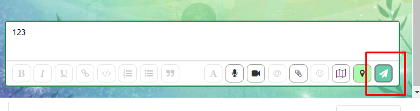
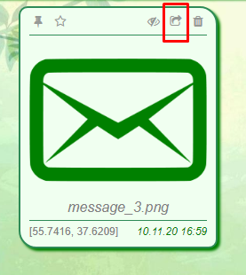

[GH-Pages](https://cazuist.github.io/ahj-8_diploma)

# Дипломное задание к курсу «Продвинутый JavaScript в браузере». 
## Chaos Organizer

### Основной функционал
  - [x] Сохранение в истории ссылок и текстовых сообщений;   

    - Поле ввода сообщение не должно быть пустым;
    -  Отправка сообщения по нажатию "Enter";
    - Отправка сообщений по нажатию на кнопку 

  - [x] Ссылки (то, что начинается с http:// или https://) должны быть кликабельны и отображаться как ссылки;

  - [x] Сохранение в истории изображений, видео и аудио, других файлов;

    - Через кнопку 
    - Через перенос файлов с компьютера 

  - [x] Скачивание файлов (на компьютер пользователя);

     - Скачивание происходит при нажатии на кнопку 	

       - скачивание происходит в системную папку ***Загрузки / Downloads***;

  - [x] Ленивая подгрузка.
***
### Дополнительный функционал
   - [x] Синхронизация при открытии в нескольких окнах / вкладках.
   - [ ] Поиск по сообщениям.
   - [x] Запись видео и аудио (используя API браузера).
     - Запись аудио/видео начинается при нажатии на кнопки  
     - Запись отменяется в окне записи файла при нажатии на кнопку 
     - Файл сохраняется в истории при нажатии на кнопку 
   - [x] Отправка геолокации.
     - Отправка геолокации возможна при "зелёной" кнопке 
     - Отправка геолокации осуществляется при нажатии на кнопку 
   - [x] Воспроизведение видео/аудио (используя API браузера);
   - [ ] Установка напоминаний и напоминания (через Notification API);
   - [ ] Отправка команд боту;
   - [x] Закрепление (pin) сообщений;
      - сообщение закрепляется при нажатии на иконку на сообщении 
      - сообщение открепляется при нажатии на кнопку на прикрепленном сообщении 
   - [x] Добавление сообщения в избранное;
      - сообщение попадает в избранное при нажатии на иконку 
      - иконка меняет цвет;
      - посмотреть избранное можно при нажатии на 
   - [ ] Просмотр вложений по категориям;
   - [ ] Работа в оффлайн-режиме;
   - [ ] Экспорт/импорт истории чата;
   - [ ] Отправка зашифрованных сообщений и файлов с просмотром расшифрованных;
   - [ ] Архивирование файлов и распаковка;
   - [ ] Поддержка оформления кода;
   - [ ] Поддержка смайликов;
   - [ ] Поддержка стикеров;